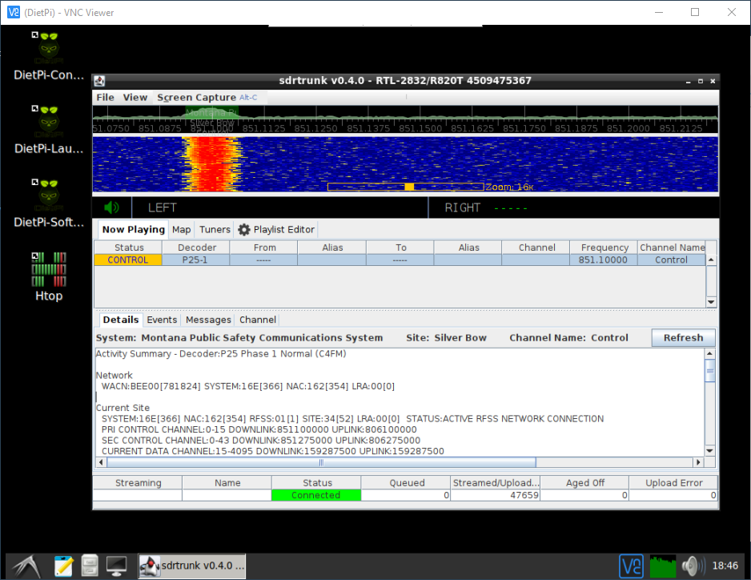
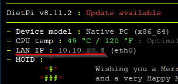

# DietPi-SDRTrunk
Automated Installer for setting up [sdrtrunk](https://github.com/DSheirer/sdrtrunk) on a [DietPi](https://github.com/MichaIng/DietPi) (Raspberry Pi) OS



> sdrtrunk running in LXDE on DietPi connected through VNC

## About:
For SBCs such as a Raspberry Pi, sdrtrunk is a pretty resource demanding java application, requiring at least [4GB of RAM and 4-core CPU](https://github.com/DSheirer/sdrtrunk#minimum-system-requirements) for minimum system requirements.

From my tests running sdrtrunk on DietPi, it looks like minimum system requirements can be reduced to 2GB of RAM and 2-core CPU.

# - Install
Follow the installation instructions provided by DietPi [here](https://dietpi.com/docs/install/) to download and image your Raspberry Pi.

## IMPORTANT!
Before you boot into DietPi for the first time, overwrite the dietpi.txt file the the "Boot" partition (/boot/dietpi.txt), with the file located [here](https://github.com/GitHubberFitz/DietPi-SDRTrunk/blob/main/dietpi.txt).

This will automate the configuration and install of the following applications while the system is provisioning.

- OpenSSH server via
    - _AUTO_SETUP_SSH_SERVER_INDEX=-2_
- LXDE desktop via
    - _AUTO_SETUP_DESKTOP_INDEX=0_
    - _AUTO_SETUP_INSTALL_SOFTWARE_ID=23_
- Java JDK via
    - _AUTO_SETUP_INSTALL_SOFTWARE_ID=8_
- DietPi Web Dashboard via
    - _AUTO_SETUP_INSTALL_SOFTWARE_ID=200_
- Git via
    - _AUTO_SETUP_INSTALL_SOFTWARE_ID=17_
- RealVNC via
    - _AUTO_SETUP_INSTALL_SOFTWARE_ID=120_

When the initial boot provisioning has finished, you should be able to VNC to the host at the IP address visible in the terminal console.



## - SDRtrunk install
Copy down the sdr-install.sh script and run with elevated privilages.

```
$> wget https://raw.githubusercontent.com/GitHubberFitz/DietPi-SDRTrunk/main/sdr-install.sh

$> sudo chmod +x sdr-install.sh

$> sudo ./sdr-install.sh
```
